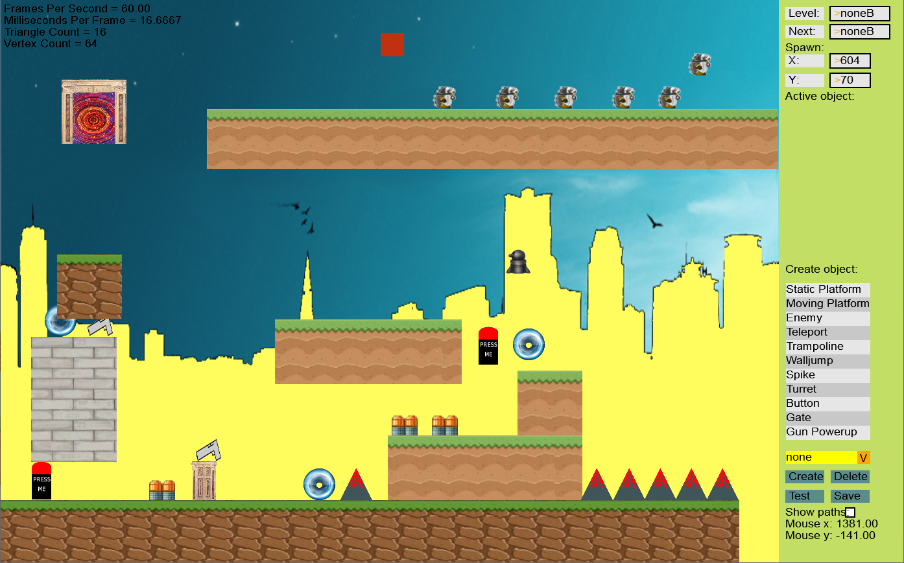

# Simply2D

This is the first game I made and it's a 2D platformer tuned to be hard and requiring precise movement in order to solve the levels.
The main feature is the editor where you can build your own custom maps by placing platforms, spikes, portals, enemies, doors etc. and modify their attributes.